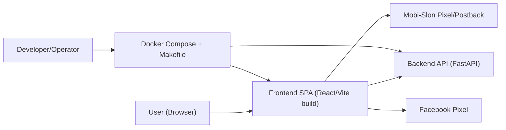
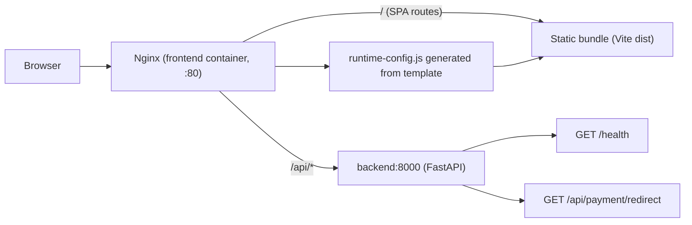

# 02. Architecture

## C4-like Context

## Container / Runtime Flow

## Runtime-компоненты
- Frontend build-time:
  - `frontend/Dockerfile` собирает SPA (`pnpm build`) из `frontend/src`.
- Frontend run-time:
  - `nginx:1.29-alpine` отдает `dist`.
  - `frontend/docker-entrypoint/40-runtime-config.sh` генерирует `runtime-config.js` из `frontend/runtime-config.js.template`.
- Backend run-time:
  - `backend/Dockerfile` устанавливает зависимости через `uv sync --locked --no-dev`.
  - Запуск `uv run uvicorn app.main:app --host 0.0.0.0 --port 8000`.

## Environments & Ports
| Окружение | Источник | Frontend | Backend | Примечание |
|---|---|---|---|---|
| Prod-like container | `docker-compose.yml` | `127.0.0.1:${FRONTEND_PORT:-8080}:80` | `127.0.0.1:${BACKEND_PORT:-8000}:8000` | Используются image `backend-${IMAGE_TAG}`, `frontend-${IMAGE_TAG}` |
| Test/Build-local container | `docker-compose.test.yml` | `127.0.0.1:${FRONTEND_PORT:-8080}:80` | `127.0.0.1:${BACKEND_PORT:-8000}:8000` | Сборка локально из Dockerfile, pull_policy включен |
| Dev backend | `docker-compose.dev.yml` | `N/A` | `8000:8000` | Backend с `--reload`, volume `./backend/app:/app/app` |
| Dev frontend | `make dev-frontend` | `5173` | через Vite proxy на `VITE_API_PROXY_TARGET` (default `http://localhost:8000`) | Локальный Vite HMR |

## Архитектурные акценты
- SPA-роутинг работает через `try_files $uri /index.html` в `frontend/nginx.conf`.
- API-проксирование для контейнерного frontend: `location /api/` -> `http://backend:8000`.
- Трекинг-конфиг читается из `window.__APP_CONFIG__` и fallback в `import.meta.env`.

## Смежные документы
- [06-deployment-and-environments](./06-deployment-and-environments.md)
- [09-api-and-integrations](./09-api-and-integrations.md)
- [10-frontend-journeys-and-routing](./10-frontend-journeys-and-routing.md)
