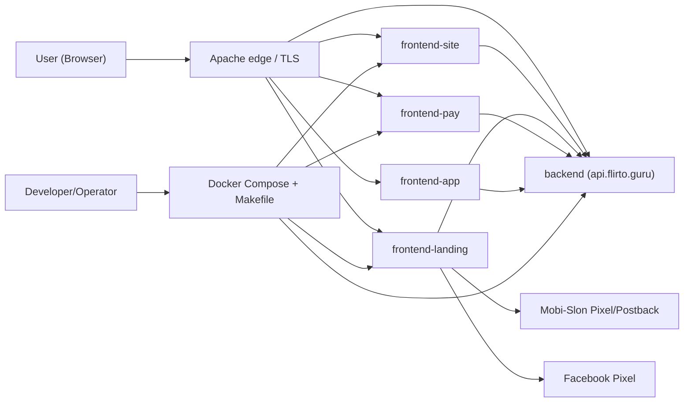
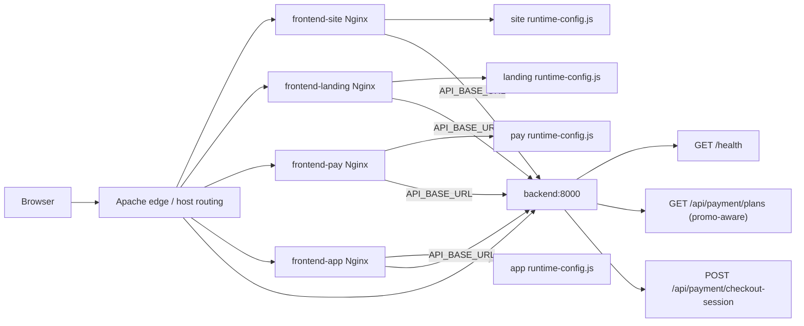

# 02. Architecture

## C4-like Context

```mermaid
flowchart LR
  user["User (Browser)"] --> edge["Apache edge / TLS"]
  edge --> site["frontend-site"]
  edge --> landing["frontend-landing"]
  edge --> pay["frontend-pay"]
  edge --> app["frontend-app"]
  edge --> be["backend (api.flirto.guru)"]
  site --> be
  landing --> be
  pay --> be
  app --> be
  landing --> mobi["Mobi-Slon Pixel/Postback"]
  landing --> meta["Facebook Pixel"]
  ops["Developer/Operator"] --> compose["Docker Compose + Makefile"]
  compose --> site
  compose --> landing
  compose --> pay
  compose --> be
```

## Container / Runtime Flow

```mermaid
flowchart LR
  br["Browser"] --> edge["Apache edge / host routing"]
  edge --> site["frontend-site Nginx"]
  edge --> landing["frontend-landing Nginx"]
  edge --> pay["frontend-pay Nginx"]
  edge --> app["frontend-app Nginx"]
  edge --> api["backend:8000"]
  site --> siteRc["site runtime-config.js"]
  landing --> landingRc["landing runtime-config.js"]
  pay --> payRc["pay runtime-config.js"]
  app --> appRc["app runtime-config.js"]
  site -->|API_BASE_URL| api
  landing -->|API_BASE_URL| api
  pay -->|API_BASE_URL| api
  app -->|API_BASE_URL| api
  api --> health["GET /health"]
  api --> plans["GET /api/payment/plans (promo-aware)"]
  api --> checkout["POST /api/payment/checkout-session"]
```

## Runtime-компоненты
- Frontend build-time:
  - `frontend-site/Dockerfile` собирает brand-site surface из `frontend-site/src`.
  - `frontend-landing/Dockerfile` собирает новый landing surface из `frontend-landing/src` и использует runtime contract `APP_SURFACE`, `API_BASE_URL`, `PAY_PUBLIC_BASE_URL`.
  - `frontend-pay/Dockerfile` собирает pay surface из `frontend-pay/src` и использует runtime contract `APP_SURFACE`, `API_BASE_URL`, `PAY_PUBLIC_BASE_URL`.
  - `frontend-app/Dockerfile` собирает PWA app surface из `frontend-app/src` и использует runtime contract `APP_SURFACE`, `API_BASE_URL`, `PAY_PUBLIC_BASE_URL`, `APP_PUBLIC_BASE_URL`, `LANDING_PUBLIC_BASE_URL`.
  - `frontend_old/Dockerfile` остается legacy/transitional build path и не является target multi-domain surface.
- Frontend run-time:
  - каждый новый frontend surface использует свой `nginx:1.29-alpine` runtime и собственный `runtime-config.js`.
  - target browser traffic больше не зависит от same-origin `/api` proxy.
- Backend run-time:
  - `backend/Dockerfile` устанавливает зависимости через `uv sync --locked --no-dev`.
  - Запуск `uv run uvicorn app.main:app --host 0.0.0.0 --port 8000`.

## Environments & Ports
| Окружение | Источник | Frontend | Backend | Примечание |
|---|---|---|---|---|
| Target production topology | внешний Apache + compose app services | `frontend-site`, `frontend-landing`, `frontend-pay`, `frontend-app` | `api.flirto.guru` -> `backend` | Apache является source of truth для host routing и TLS |
| Current prod-like container | `docker-compose.yml` | legacy `frontend` на `127.0.0.1:${FRONTEND_PORT:-8080}:80` | `127.0.0.1:${BACKEND_PORT:-8000}:8000` | Transitional single-frontend compose, не финальная topology |
| Current test/build-local | `docker-compose.test.yml` | legacy `frontend` на `127.0.0.1:${FRONTEND_PORT:-8080}:80` | `127.0.0.1:${BACKEND_PORT:-8000}:8000` | Transitional test stack |
| Current dev compose | `docker-compose.dev.yml` | `frontend-site` `5175`, `frontend-landing` `5174`, `frontend-pay` `5176`, `frontend-app` `5177`, legacy `frontend-old` `5173` | `8000:8000` | Все новые browser surfaces используют explicit API base URL |
| Local Vite HMR | `make dev-frontend*` | transitional / per-surface local runs | через explicit API base URL или proxy | Для host-based smoke нужен optional local reverse proxy |

## Архитектурные акценты
- Apache edge различает `flirto.guru`, `lp*.flirto.guru`, `pay.flirto.guru`, `api.flirto.guru` и маршрутизирует каждый host в один container target.
- Legacy SPA-роутинг и `/api` proxy остаются только у `frontend_old` как transitional behavior.
- `frontend-landing` не использует same-origin `/api` proxy и адресует browser API calls в `API_BASE_URL`.
- `frontend-site` и `frontend-pay` также используют explicit `API_BASE_URL`.
- Трекинг-конфиг читается из `window.__APP_CONFIG__` и fallback в `import.meta.env`.
- Индивидуальные промо-офферы хранятся в БД (`promo_offers`) и применяются server-side как для `/api/payment/plans`, так и для `/api/payment/checkout-session`.

## Смежные документы
- [06-deployment-and-environments](./06-deployment-and-environments.md)
- [09-api-and-integrations](./09-api-and-integrations.md)
- [10-frontend-journeys-and-routing](./10-frontend-journeys-and-routing.md)

## Bot guided-flow (v1)
- `bot` сервис (aiogram) реализует команды `/advice` и `/reset` поверх internal API backend.
- Backend хранит guided-сессии в PostgreSQL (`bot_sessions`, `bot_context_assets`, `bot_generation_runs`).
- Модель сессии: `collecting_context -> awaiting_context_confirmation -> ready_to_generate -> awaiting_refinement -> closed`.
- Для media ingestion bot скачивает файл из Telegram API, кодирует в base64 и передает в backend.
- Backend выполняет OCR/STT через OpenAI (`/responses`, `/audio/transcriptions`) и сохраняет только extracted text + metadata (без сырых bytes).
- В v1 не используется RAG; генерация и refine идут только через OpenAI. App prompt'ы locale-aware (`en` default, `ru` ручной выбор в профиле), JSON-схема ответа не меняется между языками.
