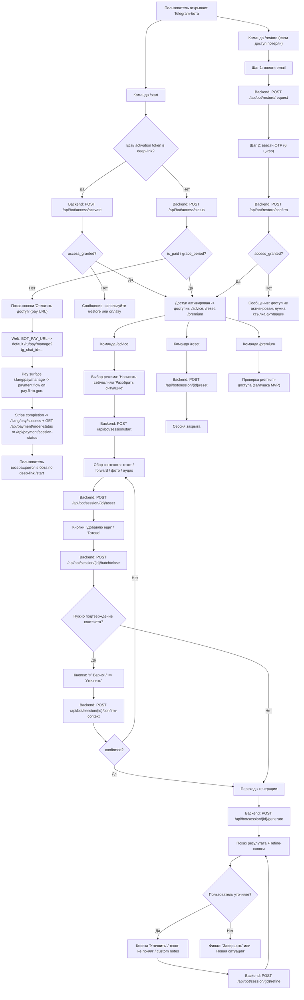
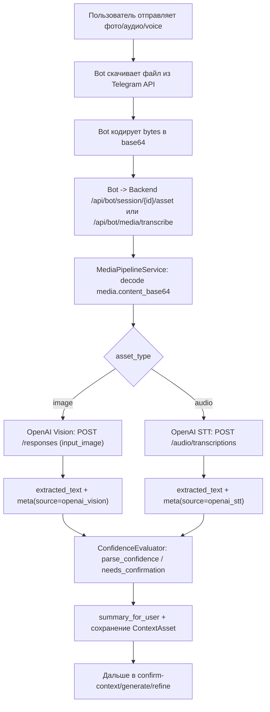

# Пользовательский путь в Telegram-боте: диаграмма и команды

## Карточка 1: Mermaid-диаграмма (пользователь + бот + backend команды)



## Карточка 2: Подробное описание шагов и всех команд

1. `Команда /start`
- Назначение: вход в бота и проверка/активация доступа.
- Если есть токен в deep-link (`/start <token>`): вызывается `POST /api/bot/access/activate`.
- Если токена нет: вызывается `POST /api/bot/access/status`.
- Результат: либо доступ активен, либо бот предлагает оплату/восстановление.

2. `Оплата (если доступа нет)`
- Пользователь нажимает кнопку `Оплатить доступ`.
- Bot открывает `BOT_PAY_URL`; если он не задан, используется fallback `${PAY_PUBLIC_BASE_URL}/ru/pay/manage`.
- Перед открытием ссылки bot добавляет `tg_chat_id` в query params.
- На pay surface дальнейший flow идет через canonical pay routes (`/:lang/pay/manage`, `/:lang/pay/success`) и backend API.
- Пользователь возвращается в бота и снова проходит `/start` с activation token.

3. `Команда /restore`
- Назначение: восстановление доступа по email+OTP.
- Шаги:
  - Ввод email -> `POST /api/bot/restore/request`.
  - Ввод OTP (6 цифр) -> `POST /api/bot/restore/confirm`.
- Итог: доступ восстановлен или выдана инструкция по активации.

4. `Команда /advice` (доступна paid/grace)
- Назначение: запуск guided-flow консультации.
- Пользователь выбирает режим:
  - `Написать сейчас` (`write_now`)
  - `Разобрать ситуацию` (`analyze_case`)
- Backend стартует сессию: `POST /api/bot/session/start`.

5. `Сбор контекста (основной цикл)`
- Пользователь отправляет:
  - текст,
  - forwarded сообщения,
  - фото (OCR),
  - аудио/voice (STT).
- На каждый фрагмент: `POST /api/bot/session/{session_id}/asset`.
- Кнопки:
  - `Добавлю еще` (`batch:more`) — продолжить сбор.
  - `Готово` (`batch:close`) — закрыть batch через `POST /api/bot/session/{session_id}/batch/close`.

6. `Подтверждение контекста`
- Если backend требует подтверждение:
  - `✅ Верно` (`confirm:yes`)
  - `✏️ Уточнить` (`confirm:edit`)
- Запрос: `POST /api/bot/session/{session_id}/confirm-context`
- Уточнение дается свободным текстом

7. `Генерация ответа`
- Команда backend: `POST /api/bot/session/{session_id}/generate`.
- Бот показывает: рекомендацию, объяснение, риски, следующий шаг (в зависимости от режима).

8. `Refine (доработка ответа)`
- Пользователь может уточнять результат:
  - кнопкой `Уточнить`,
  - текстом (`не понял` поддерживается),
  - custom notes.
- Команда backend: `POST /api/bot/session/{session_id}/refine`.
- Цикл повторяется до финального результата.

9. `Завершение или новый кейс`
- Кнопки:
  - `Завершить` (`refine:finish`)
  - `Новая ситуация` (`refine:new_session`)

10. `Команда /reset`
- Принудительно закрывает текущую guided-сессию.
- Backend: `POST /api/bot/session/{session_id}/reset`.

11. `Команда /premium`
- Подтверждение premium-доступа (в MVP сейчас заглушка с сообщением).

12. `Команда /help`
- Показывает список доступных команд.
- Фактически для unpaid-пользователя через middleware разрешены только `/start` и `/restore`; остальные команды требуют paid/grace.

## Примечание по миграции Flirto Guru
- В v1 bot flow не ведет пользователя в landing funnel и не использует `BOT_LANDING_URL`.
- Browser-owned `pay_success` не используется: terminal payment event отправляется server-side из Stripe webhook.

## Карточка 3: Что передается в OpenAI и что приходит обратно (JSON-контракты)

### 3.1 Вызов OpenAI для генерации (`write_now`, `analyze_case`)

Backend использует `POST {OPENAI_API_BASE}/responses` и передает payload формата:

```json
{
  "model": "gpt-5.2",
  "input": [
    {
      "role": "system",
      "content": [
        { "type": "input_text", "text": "<system_prompt>" }
      ]
    },
    {
      "role": "user",
      "content": [
        { "type": "input_text", "text": "<user_prompt>" }
      ]
    }
  ]
}
```

Где:
- `<system_prompt>`: системные правила (безопасность, стиль, формат строго JSON).
- `<user_prompt>`: собранный контекст диалога, цель, ограничения, режим (`standard`/`offline_first_message`), RAG-контекст (если включен).

### 3.2 Что backend ожидает получить от OpenAI

Backend читает ответ как:
- сначала `output_text`,
- если пусто: собирает текст из `output[].content[].text`,
- затем парсит JSON из текста.

Для `write_now` ожидается JSON (строго схема `WriteNowResponseSchema`):

```json
{
  "primary_message": "string",
  "why": "string",
  "risks": ["string"],
  "avoid_list": ["string", "string", "string"],
  "next_step": "string",
  "fallback_simple_version": "string",
  "alternatives": ["string"]
}
```

Для `analyze_case` ожидается JSON (строго схема `AnalyzeCaseResponseSchema`):

```json
{
  "diagnosis": "string",
  "core_leverage": "string",
  "plan_24h": ["string"],
  "plan_if_reply": ["string"],
  "plan_if_no_reply": ["string"],
  "message_template": "string",
  "avoid_list": ["string", "string", "string"]
}
```

Для `refine` (custom-уточнение) backend просит JSON такого вида:

```json
{
  "primary_message": "string",
  "why": "string",
  "fallback_simple_version": "string",
  "alternatives": ["string"]
}
```

### 3.3 Внешний API контракта генерации/доработки (bot <-> backend)

`POST /api/bot/session/{session_id}/generate` request:

```json
{
  "scenario": "standard",
  "offline_first_message": {
    "meet_place": "string",
    "goal": "string"
  },
  "tone": "string",
  "constraints": ["string"],
  "tried_actions": ["string"],
  "target_outcome": "string"
}
```

`POST /api/bot/session/{session_id}/generate` response:

```json
{
  "session_id": "uuid",
  "mode": "write_now",
  "state": "awaiting_refinement",
  "next_step": "refine_or_finish",
  "llm_provider": "openai",
  "model_name": "gpt-5.2",
  "ui_payload": {
    "primary_message": "string",
    "why": "string",
    "risks": ["string"],
    "avoid_list": ["string", "string", "string"],
    "next_step": "string",
    "fallback_simple_version": "string",
    "alternatives": ["string"]
  }
}
```

`POST /api/bot/session/{session_id}/refine` request:

```json
{
  "command": "уточнить под меня: сделать мягче, короче, без вопроса в конце"
}
```

`POST /api/bot/session/{session_id}/refine` response (включая legacy-поля):

```json
{
  "session_id": "uuid",
  "mode": "write_now",
  "state": "awaiting_refinement",
  "llm_provider": "openai",
  "model_name": "gpt-5.2",
  "ui_payload": {
    "primary_message": "string",
    "why": "string",
    "risks": ["string"],
    "avoid_list": ["string", "string", "string"],
    "next_step": "string",
    "fallback_simple_version": "string",
    "alternatives": ["string"]
  },
  "primary_message": "string",
  "why": "string",
  "fallback_simple_version": "string",
  "next_step": "string",
  "alternatives": ["string"]
}
```

## Карточка 4: Как аудио и картинки превращаются в текст (OCR/STT)

### 4.1 Mermaid: media pipeline



### 4.2 Контракт media payload (bot -> backend)

Фото/аудио передаются через `payload.media`:

```json
{
  "asset_type": "image",
  "payload": {
    "caption": "необязательно",
    "media": {
      "mime_type": "image/jpeg",
      "content_base64": "<base64>",
      "file_name": "telegram-photo-123.jpg"
    }
  },
  "telegram_message_id": 101
}
```

```json
{
  "asset_type": "audio",
  "payload": {
    "duration_seconds": 12,
    "media": {
      "mime_type": "audio/ogg",
      "content_base64": "<base64>",
      "file_name": "telegram-voice-123.ogg",
      "duration_seconds": 12
    }
  },
  "telegram_message_id": 102
}
```

Валидация backend:
- для `image/audio` обязательны `media.mime_type` + `media.content_base64`;
- legacy `file_id` поддержан только как controlled error path (подсказка обновить transport);
- лимит размера проверяется (`BOT_MEDIA_MAX_BYTES`), превышение -> доменная ошибка.

### 4.3 Вызовы OpenAI внутри media pipeline

OCR (картинка):
- endpoint: `POST {OPENAI_API_BASE}/responses`
- модель: `gpt-5.2`
- content: `input_text` (инструкция извлечь текст+контекст) + `input_image` (data URI).

STT (аудио):
- endpoint: `POST {OPENAI_API_BASE}/audio/transcriptions`
- модель: `gpt-4o-transcribe`
- multipart: `file=<bytes>` + `model=gpt-4o-transcribe`.

### 4.4 Что возвращается из media pipeline

Внутренний результат обработки ассета:
- `extracted_text` (уже с label, например `Пользователь:`/`Девушка:` при forward);
- `parse_confidence` (0..1);
- `needs_confirmation` (bool);
- `role_ambiguity` (bool);
- `summary_for_user` (короткие пункты для UI);
- `extraction_meta` (`source`, `mime_type`, `byte_size`, `confidence_reasons`, `threshold`, и др.).

Публично через endpoint для транскрибации:

`POST /api/bot/media/transcribe` request:

```json
{
  "asset_type": "audio",
  "payload": {
    "media": {
      "mime_type": "audio/ogg",
      "content_base64": "<base64>",
      "file_name": "telegram-voice-123.ogg"
    }
  }
}
```

`POST /api/bot/media/transcribe` response:

```json
{
  "text": "распознанный текст"
}
```

## Карточка 5: Тексты промптов (дословно из кода)

Ниже шаблоны prompt'ов, которые backend отправляет в OpenAI.  
Переменные в фигурных скобках подставляются runtime-значениями.

### 5.1 `write_now` генерация

`system_prompt`:

```text
Ты senior-эксперт по знакомствам, коммуникации и дейтинговым сценариям. Дай практичный, безопасный, реалистичный вариант сообщения для знакомства/продолжения общения. Фокус домена: знакомство, общение, соблазнение с девушкой. Пиши по-русски, кратко, уважительно, без манипуляций и без давления. Верни ровно один JSON-объект строго формата WriteNowResponseSchema.
```

`user_prompt`:

```text
Сформируй JSON для схемы WriteNowResponseSchema.
Домен: знакомство/общение/соблазнение с девушкой.
Сценарий: {scenario}
Цель: {target_outcome_or_default}
Тон: {tone_or_default}
Ограничения: {constraints}
Контекст пользователя: {context}
{optional_rag_line}
offline_first_message: {offline_first_message_dict}
Требования:
- Ответ только JSON, без markdown.
- Разрешены только ключи: primary_message, why, risks, avoid_list, next_step, fallback_simple_version, alternatives.
- Запрещены вложенные обертки response/write_now/meta и любые лишние ключи.
- avoid_list ровно 3 пункта.
- risks минимум 1 пункт.
- risks должен быть массивом строк (не объектов).
- Тон живой и уважительный, без манипуляций, без токсичности, без давления.
```

### 5.2 `analyze_case` генерация

`system_prompt`:

```text
Ты senior-эксперт по знакомствам и разбору межличностных ситуаций. Дай структурный и практичный план действий, который снижает напряжение и помогает вернуть диалог. Фокус домена: знакомство, общение, соблазнение с девушкой. Пиши по-русски, безопасно, уважительно, без манипуляций и без давления. Верни ровно один JSON-объект строго формата AnalyzeCaseResponseSchema.
```

`user_prompt`:

```text
Сформируй JSON для схемы AnalyzeCaseResponseSchema.
Домен: знакомство/общение/соблазнение с девушкой.
Цель: {target_outcome_or_default}
Что уже пробовали: {tried_actions}
Ограничения: {constraints}
Контекст пользователя: {context}
{optional_rag_line}
Требования:
- Ответ только JSON, без markdown.
- Разрешены только ключи: diagnosis, core_leverage, plan_24h, plan_if_reply, plan_if_no_reply, message_template, avoid_list.
- Запрещены любые лишние ключи и вложенные обертки.
- plan_24h, plan_if_reply, plan_if_no_reply: минимум по 1 пункту.
- avoid_list: минимум 3 пункта.
- Все элементы plan_* и avoid_list должны быть строками.
- Каждый элемент plan_* должен быть одним конкретным действием в повелительной форме и начинаться с глагола (например: «Отправь...», «Уточни...», «Предложи...»).
- Не начинай элементы plan_* с вводных конструкций «Если...», «Когда...», «В случае...». Условия можно писать после глагола.
- Каждый элемент plan_* должен быть не короче 6 слов и содержать конкретику (что сделать + с какой целью/в какие сроки).
- Пиши конкретные действия, без обвинений, без давления, без манипуляций.
```

### 5.3 `refine` (custom уточнение под пользователя)

`system_prompt`:

```text
Ты senior-эксперт по знакомствам и коммуникации. Тебе дано исходное сообщение и уточнения пользователя, что нужно поменять. Сформируй обновленную версию сообщения по уточнениям, без манипуляций и давления.
```

`user_prompt`:

```text
Верни только JSON-объект без markdown с ключами:
- primary_message (str)
- why (str)
- fallback_simple_version (str)
- alternatives (array of str, можно пустой)
Исходное сообщение: {base_text}
Уточнения пользователя: {custom_notes}
Требования:
- Сохрани намерение исходного сообщения.
- Учти все уточнения пользователя.
- primary_message <= 420 символов.
- Ответ на русском.
```

### 5.4 OCR prompt для изображений

`input_text` в OpenAI Vision запросе:

```text
Analyze the entire image, not only visible text. Return concise plain text in Russian with: 1) visible text snippets, 2) key scene/context details, 3) probable speaker-role cues if present, 4) uncertainties if any.
```
